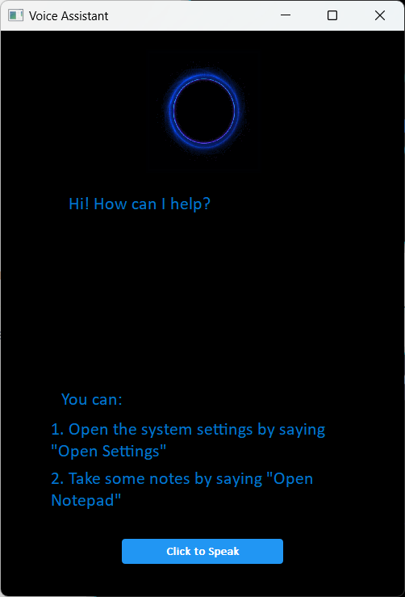

# Voice Assistant

## Instructions

- **Dependencies**

  - python 3.7
  - SpeechRecongnition module
  - PocketSphinx module
  - PyAudio module
  - PyQt5 module

- **Usage**

  First you need to have a good network environment that can access Google. Then you should install all of these modules above by using pip, type `python ./asr.py` in the terminal of the project folder. Then you’ll see the Voice Assistant runs.

  Now you can press and hold the button at the bottom of the interface and try to say commands like "open notepad" and "open settings" to make the voice assistant work for you.

## Interface

   

 