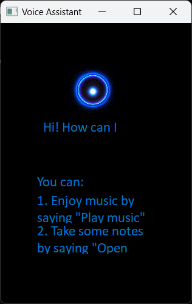
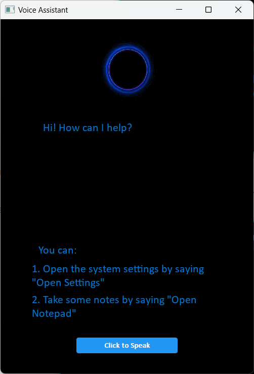

# Automatic Speech Recognition

## 1. The Modifications to the GUI

- **the origin GUI**

  
  
- **after modification**

  

The modifications are generally in two aspects:

  

1. **Make the user interaction area larger and more agile**

    I made the user interaction area larger so that I could better show the user what the Voice Assistant is currently doing. When the user holds down the button to start recording, the area displays the text `Listenning...` to inform the user that the software is recording, when the recording is over, the area will display a message `Wait for a minute, I'm recognizing...` to tell the user that the recognition is being recognized, and the identified content will be displayed in this area after the recognition is completed.
  
2. **Add a button to complete the main function and the interaction of users**
  
     When the user holds down the button, recording starts and the text displayed on the button changes to `Listening...` to tell the user recording is ongoing. And, when the user's mouse crosses and the button is held, the button changes its color to give the user feedback.

## 2. The Modifications to the codes

- `asrInterface.py`

  At the beginning of the `setUi()` function, I use uniform variables to represent the size of the window and different controls and the font size for easy modification. At the same time, considering the resolution of different screens, I also control the size of controls and windows by obtaining the screen resolution and using the ratio.

  ```python
  desktop=QtWidgets.QApplication.desktop()
  screenHeight=desktop.screenGeometry().height()
  screenWidth=desktop.screenGeometry().width()
  # print(screenHeight,screenWidth)
  uiWidth=int((500/1920)*screenWidth)
  uiHeight=int((700/1080)*screenHeight)
  fontSize=13
  voiceWidth=int((250/1920)*screenWidth)
  voiceHeight=int((200/1080)*screenHeight)
  voicePosX=(uiWidth-voiceWidth)//2
  voicePosY=0
  labelWidth=uiWidth//3*2
  labelHeight=int((160/1080)*screenHeight)
  labelPosX=(uiWidth-labelWidth)//2
  labelPosY=voicePosY+voiceHeight
  label2Width=int((350/1920)*screenWidth)
  label2Height=int((30/1080)*screenHeight)
  label2PosX=(uiWidth-label2Width)//2
  label2PosY=labelPosY+labelHeight+int((80/1080)*screenHeight)
  label3Width=uiWidth//4*3
  label3Height=int((51/1080)*screenHeight)
  label3PosX=(uiWidth-label3Width)//2
  label3PosY=label2PosY+label2Height+int((10/1080)*screenHeight)
  label4Width=label3Width
  label4Height=label3Height
  label4PosX=(uiWidth-label4Width)//2
  label4PosY=label3PosY+label3Height+int((10/1080)*screenHeight)
  buttonWidth=int((200/1920)*screenWidth)
  buttonHeight=int((31/1080)*screenHeight)
  buttonPosX=(uiWidth-buttonWidth)//2
  buttonPosY=uiHeight-buttonHeight-int((40/1080)*screenHeight)
  ```

  In addition, I also added the code of the main function button, and used the qss style sheet to customize the appearance of the button.

  ```python
  self.recognizeButton = QtWidgets.QPushButton(self.centralwidget)
  self.recognizeButton.setGeometry(QtCore.QRect(buttonPosX, buttonPosY, buttonWidth, buttonHeight))
  font = QtGui.QFont()
  font.setFamily("Calibri")
  font.setPointSize(fontSize)
  self.recognizeButton.setFont(font)
  self.recognizeButton.setStyleSheet("QPushButton {\n"
      "    background-color: #2196F3;\n"
      "    border: none;\n"
      "    color: white;\n"
      "    padding: 8px 16px;\n"
      "    text-align: center;\n"
      "    text-decoration: none;\n"
      "    display: inline-block;\n"
      "    font-size: 14px;\n"
      "    font-weight: 500;\n"
      "    border-radius: 4px;\n"
      "}\n"
      "\n"
      "QPushButton:hover {\n"
      "    background-color: #64B5F6;\n"
      "}\n"
      "\n"
      "QPushButton:pressed {\n"
      "    background-color: #1976D2;\n"
      "}")
  self.recognizeButton.setObjectName("recognizeButton")
  self.recognizeButton.setText("Recognize")
  ```
  
- `asr.py`

  1. Added the function of opening system settings and Notepad, when it is recognized that the user's command contains settings and notepad, it will execute the corresponding function.
  2. By executing the function of speech recognition in a new thread, it avoids the phenomenon that the interface will freeze during the speech recognition process.
  3. By setting a flag `isRecording` to note the recoding status, with the value of `isRecording`,the GUI will show different contents.

## 3. How to Improve the Accuracy of Speech Recognition

1. **Use other APIs of the SpeechRecogniton module**

   This module provides the following speech recognition APIs:

   - `recognize_bing()`: Microsoft Bing Speech
   - `recognize_google()`: Google Web Speech API
   - `recognize_google_cloud()`: Google Cloud Speech - requires installation of the google-cloud-speech package
   - `recognize_houndify()`: Houndify by SoundHound
   - `recognize_ibm()`: IBM Speech to Text
   - `recognize_sphinx()`: CMU Sphinx - requires installing PocketSphinx
   - `recognize_wit()`: Wit.ai

   We can use other APIs than `recognize_sphinx()` to improve speech recognition accuracy, such as `recognize_bing()` ans `recognize_google()`.

2. **Acoustic Model Training**
   We can train our own acoustic model using our own speech data, which can significantly improve the accuracy of speech recognition. There are several tools and libraries available for acoustic model training, such as Kaldi, DeepSpeech, and CMU Sphinx.

3. **Language Model Adaptation**
   Language models can be adapted to specific domains, tasks, or speakers to improve recognition accuracy. For example, if we are building a speech recognition system for a specific domain, such as medical transcription, we can train a language model specifically for that domain.

4. **Noise Reduction**

   Noise in the audio signal can significantly reduce the accuracy of speech recognition. We can apply noise reduction techniques to remove noise from the audio signal before feeding it to the speech recognition system.


